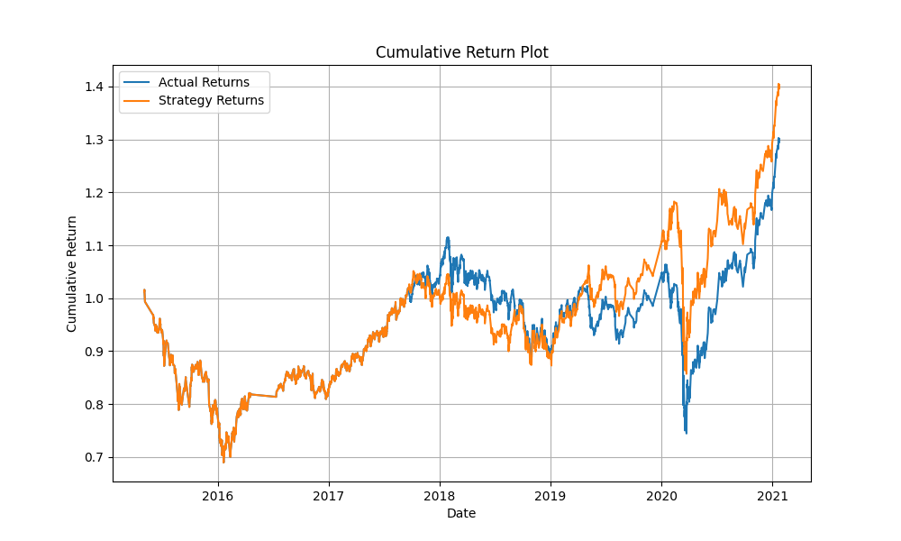
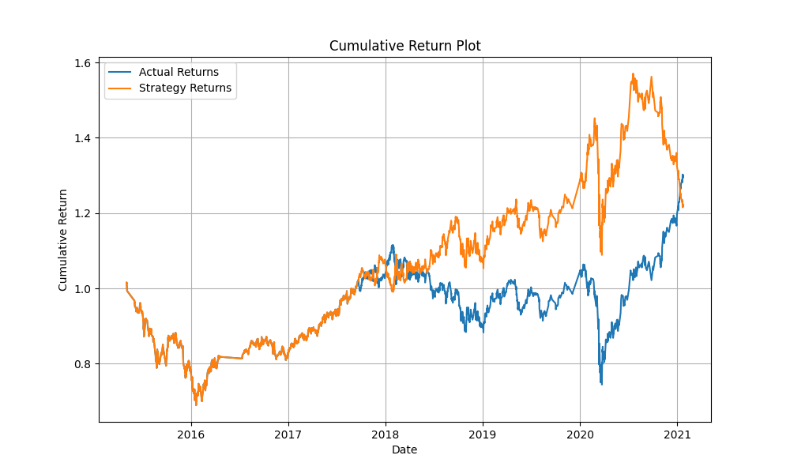
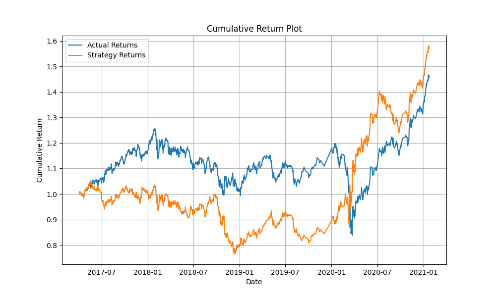
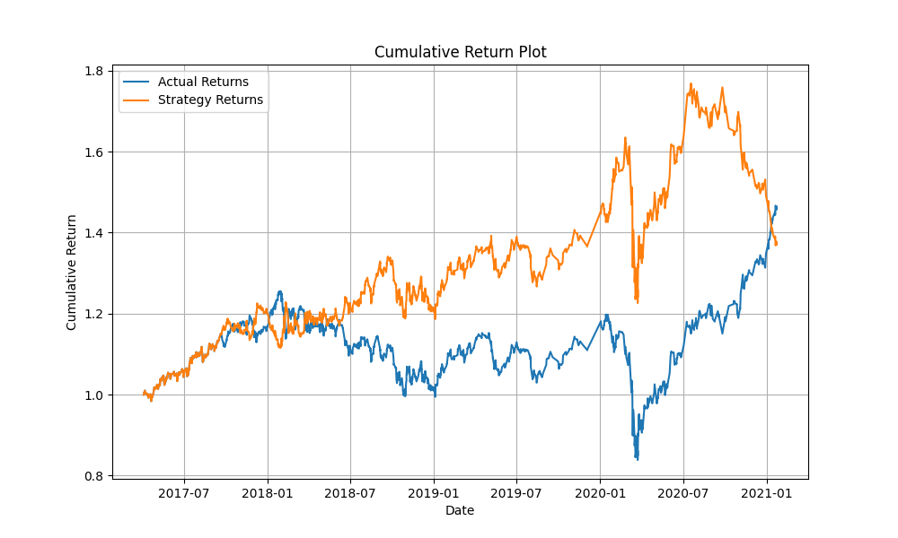
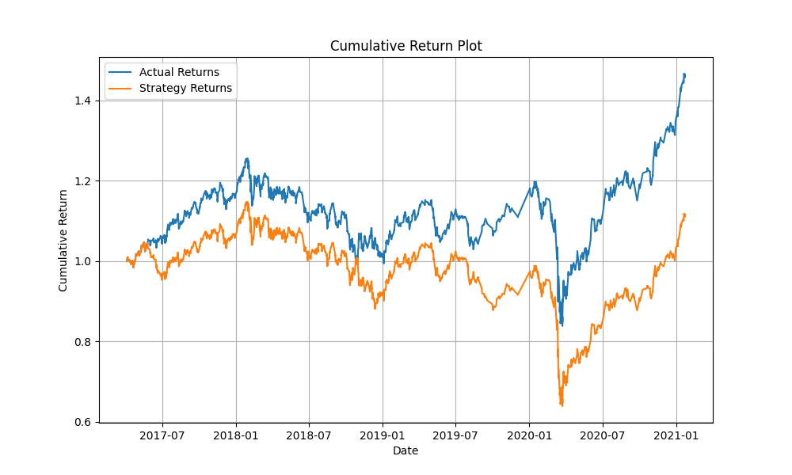
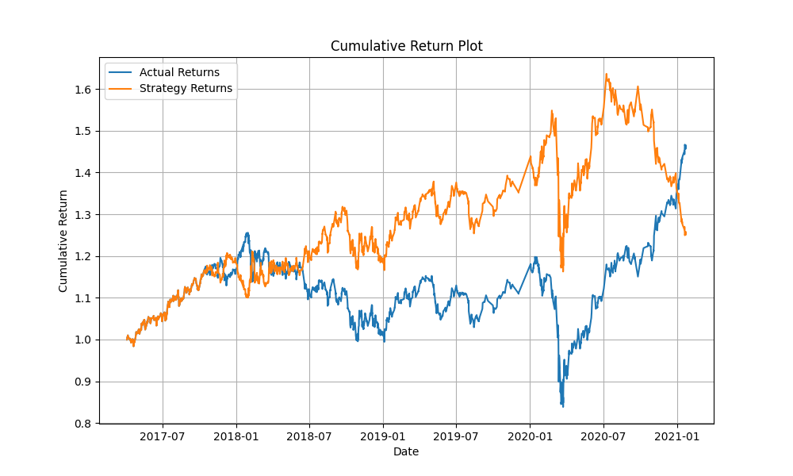
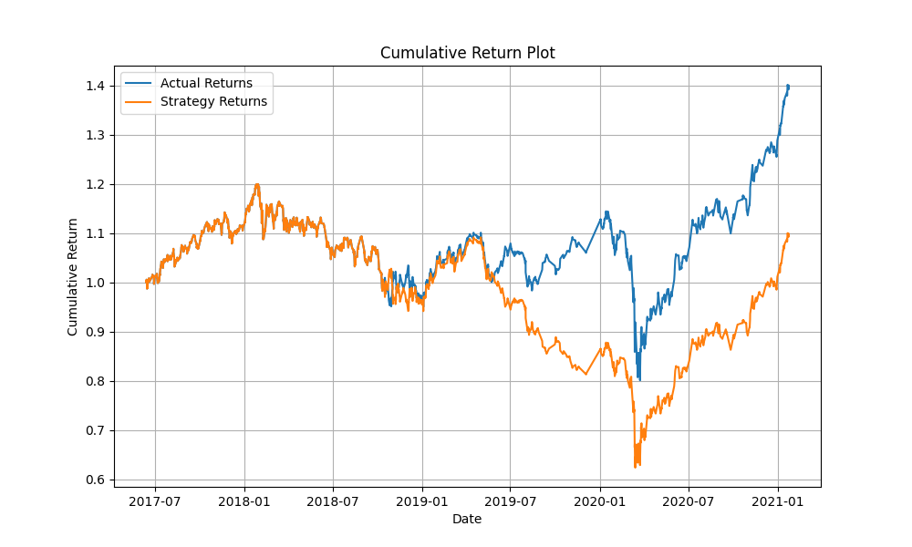
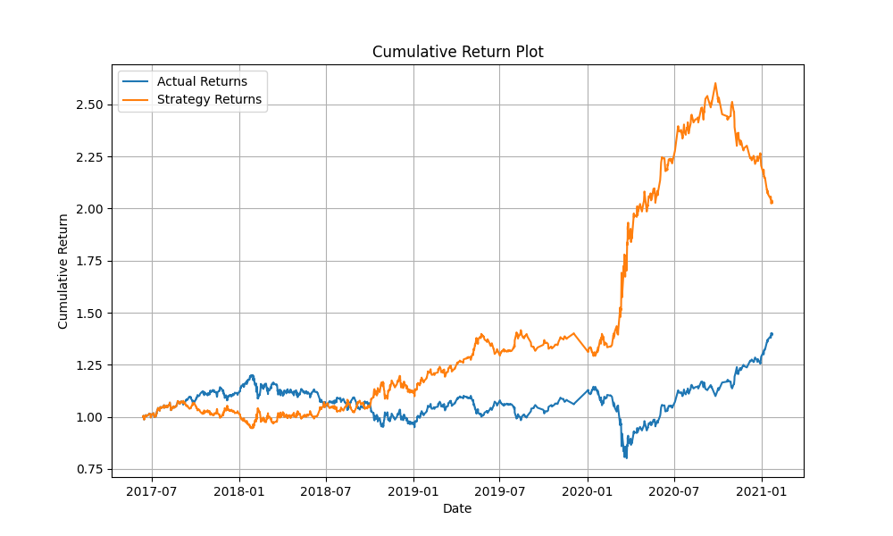
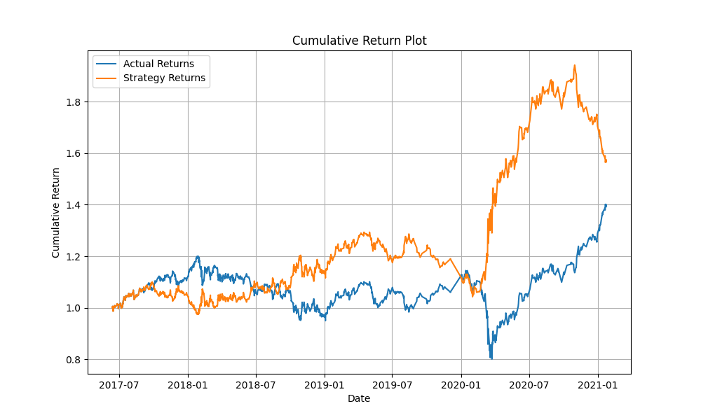

# Evaluation Report
## Reducing the training window.

### **SVC(C=1,gamma=1)**

**Classification Report**

| | precision | recall | f1-score | support |
|----|----|----|----|----|
|-1.0|0.41| 0.06|0.10|1828|
| 1.0 | 0.56 |0.94|0.70|2324|
|accuracy| | |0.55|4152 |
|macro avg|0.49|0.40 |0.48|4152|
|weighted avg|0.49| 0.55| 0.44|4152|

**Cummulative returns plot**

Reducing the training window to 1 month results in almost similar returns to that of three months period. The strategic Returns are exactly same as the actualt returns upto around November 2018, then returns underperform the actual returns upto around January 2019. The return improves but still slightly underperform the actual returns upto March 2019. The strategic returns then slightly outperforms the actual return for the remainder of the period attaining a maximum cummulative return  of 1.4 compared to 1.3 for the actual returns.

### **AdaBoostClassifier(learning_rate=0.001, n_estimators=500)**

**Classification Report**

| | precision | recall | f1-score | support |
|----|----|----|----|----|
|-1.0|0.43| 0.28|0.34|1828|
| 1.0 | 0.56 |0.71|0.62|2324|
|accuracy| | |0.52|4152 |
|macro avg|0.50|0.50 |0.48|4152|
|weighted avg|0.50| 0.52| 0.50| 4152|

**Cummulative returns plot**

In the AdaBoostClassifier Model, reducing the training window to 1 month the results in almost similar returns to that of three months period. The Strategic Returns are exactly same as the actualt returns upto around december 2018, then returns becomes unstable throughout December 2018, with some slight underperformance upto around April 2019. The Strategic returns then significantly improves outperforming the actual returns before topping at around June 2020 with a cummulative return of approximately 1.58 . The strategic returns then significantly dips throughout the remaining period until the actual returns outperforms it in the beginning of 2021. 

## Increasing the training window.
- Increasing the training window to 24 months yields the following results:

### **SVC(C=1,gamma=1)**

**Classification Report**

| | precision | recall | f1-score | support |
|----|----|----|----|----|
|-1.0|0.43| 0.29|0.35|1229|
| 1.0 | 0.56 |0.70|0.62|1565|
|accuracy| | |0.52|2794 |
|macro avg|0.49|0.50 |0.48|2794|
|weighted avg|0.50| 0.52| 0.50|2794|

**Cummulative returns plot**

Increasing the training window to 24 months results in significantly worst returns compared to that of three months period. The strategic Returns significantly underperform the actual returns upto around Match 2020. The Stategic returns then slightly outperform the actual returns for the remainder of the period.

### **AdaBoostClassifier(learning_rate=0.001, n_estimators=500)**

**Classification Report**

| | precision | recall | f1-score | support |
|----|----|----|----|----|
|-1.0|0.43| 0.42|0.43|1229|
| 1.0 | 0.56 |0.57|0.56|1565|
|accuracy| | |0.50|2794 |
|macro avg|0.50|0.50 |0.50|2794|
|weighted avg|0.50| 0.50| 0.50|2794|

**Cummulative returns plot**

For the AdaBoostClassifier model, increasing the training window to 24 months results in significantly better returns compared to that of three months period. The strategic returns are either equal or slightly less than the actual returns uptou around March 2018. The Strategig returns then significantly outperform the actual returns topping at around August 2020 with a cummulative ruturn of approximately 1.78. The Stategic returns then dips throughout the remaining period until the actual returns outperforms it in the beginning of 2021.

## Using SMA with a short_window of 20 and a long_window of 100. ( with 24 months period)

### **SVC(C=1,gamma=1)**

**Classification Report**

| | precision | recall | f1-score | support |
|----|----|----|----|----|
|-1.0|0.46| 0.10|0.16|1229|
| 1.0 | 0.56 |0.91|0.69|1565|
|accuracy| | |0.55|2794 |
|macro avg|0.51|0.50 |0.43|2794|
|weighted avg|0.52| 0.55| 0.46|2794|

**Cummulative returns plot**

For the SVC model, setting up the simple moving average with a short window of 20 and a long window of 100 resulted in worse returns than that when the short window is 4 and the long window of 100. The Strategic returns  underperforms the actual returns throughout the traded period.

### **AdaBoostClassifier(learning_rate=0.001, n_estimators=500)**

**Classification Report**

| | precision | recall | f1-score | support |
|----|----|----|----|----|
|-1.0|0.43| 0.39|0.41|1229|
| 1.0 | 0.55 |0.58|0.57|1565|
|accuracy| | |0.50|2794 |
|macro avg|0.49|0.49 |0.50|2794|
|weighted avg|0.50| 0.50| 0.50|2794|

**Cummulative returns plot**

For the AdaBoostClassifier model, setting up the simple moving average with a short window of 20 and a long window of 100 have similar results to that when the short window is 4 and the long window of 100, but slightly lower (has a maximum cummulative return of approximately 1.62).

## Using SMA with a short_window of 50 and a long_window of 200. ( with 24 months period)

### **SVC(C=1,gamma=1)**

**Classification Report**

| | precision | recall | f1-score | support |
|----|----|----|----|----|
|-1.0|0.47| 0.12|0.19|1229|
| 1.0 | 0.56 |0.89|0.69|1565|
|accuracy| | |0.55|2794 |
|macro avg|0.51|0.51 |0.44|2794|
|weighted avg|0.52| 0.55| 0.47|2794|

**Cummulative returns plot**

For the SVC model, setting up the simple moving average with a short window of 50 and a long window of 200 resulted in worse returns than that when the short window is 4 and the long window of 100 but better than when the short window is 20 and the long window of 100. The Strategic returns are similar to the Actual returns upto around June 2019 before significantly underperforming the actual returns throughout the remaining period.

### **AdaBoostClassifier(learning_rate=0.001, n_estimators=500)**

**Classification Report**

| | precision | recall | f1-score | support |
|----|----|----|----|----|
|-1.0|0.45| 0.72|0.56|1229|
| 1.0 | 0.58 |0.31|0.41|1565|
|accuracy| | |0.49|2794 |
|macro avg|0.52|0.52 |0.48|2794|
|weighted avg|0.53| 0.49| 0.47|2794|

**Cummulative returns plot**

For the AdaBoostClassifier model, setting up the simple moving average with a short window of 50 and a long window of 200 has way better results to that when the short window is 4 and the long window of 100. The Strategic returns slightly underperform the actual returns upto around September 2018. The Strategic returns then significantly outperform the actual returns with a maximum cummulative return of approximately 2.6 at around September 2020, then oly reducing to about 2.0 for the remaider of the period.

## Model Parameter Tuning ( with 24 months period, short_window of 50 and a long_window of 200 )

### **SVC(C=100, gamma=1)**

**Classification Report**

| | precision | recall | f1-score | support |
|----|----|----|----|----|
|-1.0|0.45| 0.52|0.48|1151|
| 1.0 | 0.56 |0.49|0.52|1452|
|accuracy| | |0.50|2603 |
|macro avg|0.50|0.50 |0.50|2603|
|weighted avg|0.51| 0.50| 0.50|2603|

**Cummulative returns plot**

**Conclusion**

Setting the parameters C=100 and gamma=1 in combination with 24 months trining perion and a SMA with short_window of 50 and a long_window of 200, resulted in the best Strategic returns for the SVC model. The Strategic model tops at approximately 1.9 before slightly dropping to approximately 1.59 levels. Therefore, as much as the baseline trading algorithm using an SVC model did not perform well in terms of accuracy and profitability. It significantly improved by tuning the model parameters, using more training data and applying higher SMA settings.

### **AdaBoostClassifier(learning_rate=0.001, n_estimators=1000)**

**Classification Report**

| | precision | recall | f1-score | support |
|----|----|----|----|----|
|-1.0|0.45| 0.72|0.56|1151|
| 1.0 | 0.58 |0.31|0.41|1452|
|accuracy| | |0.49|2603 |
|macro avg|0.52|0.52| 0.48|2603|
|weighted avg|0.53| 0.49| 0.47|2603|

**Cummulative returns plot**

**Conclusion**

The base model had a learning rate of 0.001 and 500 n_estimators. Increasing the n_estimators to 1000 did not further improve the model. This model had the best returns significantly surpasing that of the SVC model. Using  an ensemble model in addition to using more training data and applying higher SMA settings, clearly led to even better returns for our trading algorithm.